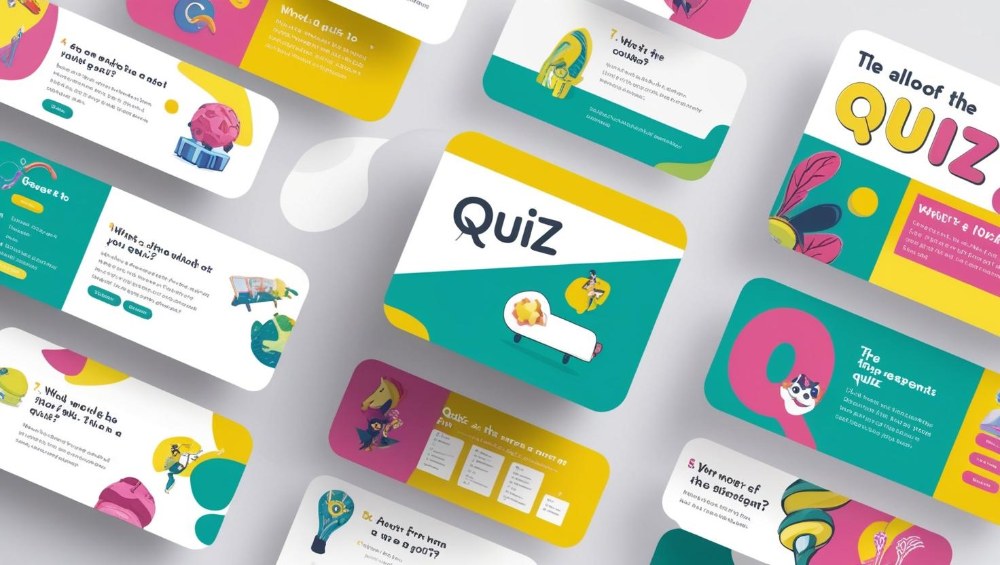

# Quizfy

## 🚀 Live Demo
👉 https://codewithkinshu54.github.io/Quizzfy/

Quizfy is an interactive quiz web application that challenges users with fun and engaging quizzes across multiple categories.

  

## Project Description

Quizfy is a modern, user-friendly quiz platform designed to make learning enjoyable through interactive knowledge testing. The platform offers diverse quiz categories catering to different interests and knowledge levels, allowing users to challenge themselves and compete with others.

The application features a clean, responsive interface that works seamlessly across desktops, tablets, and mobile devices. Users can track their progress over time, view their achievements on leaderboards, and enjoy a gamified learning experience that makes knowledge acquisition fun and engaging.

Quizfy aims to create a community of knowledge enthusiasts who can learn, compete, and grow together through challenging quizzes and friendly competition.

## Features

- **Interactive Quizzes**: Engage with dynamic and fun quizzes across multiple categories.
- **Leaderboard**: Compete with friends and see your name on the leaderboard.
- **Progress Tracking**: Track your progress and improve your knowledge over time.
- **Responsive Design**: Enjoy a seamless experience on any device, anywhere.

## Pages

- **Home**: Welcome page with features and testimonials
- **Categories**: Browse different quiz categories
- **Leaderboard**: See top performers
- **About**: Learn more about Quizfy
- **Contact**: Get in touch with us

## Technologies Used

- HTML5
- CSS3
- JavaScript

## Screenshots

### Features Section

.jpg)
.jpg)
.jpg)

## User Testimonials

"Quizfy has made learning so much fun! I love the interactive quizzes." - Sarah J.

"The leaderboard feature keeps me motivated to improve my score." - John D.

"The design is so clean and responsive. Works perfectly on my phone!" - Emily R.

## Copyright

© 2025 Quizffy. All rights reserved.
